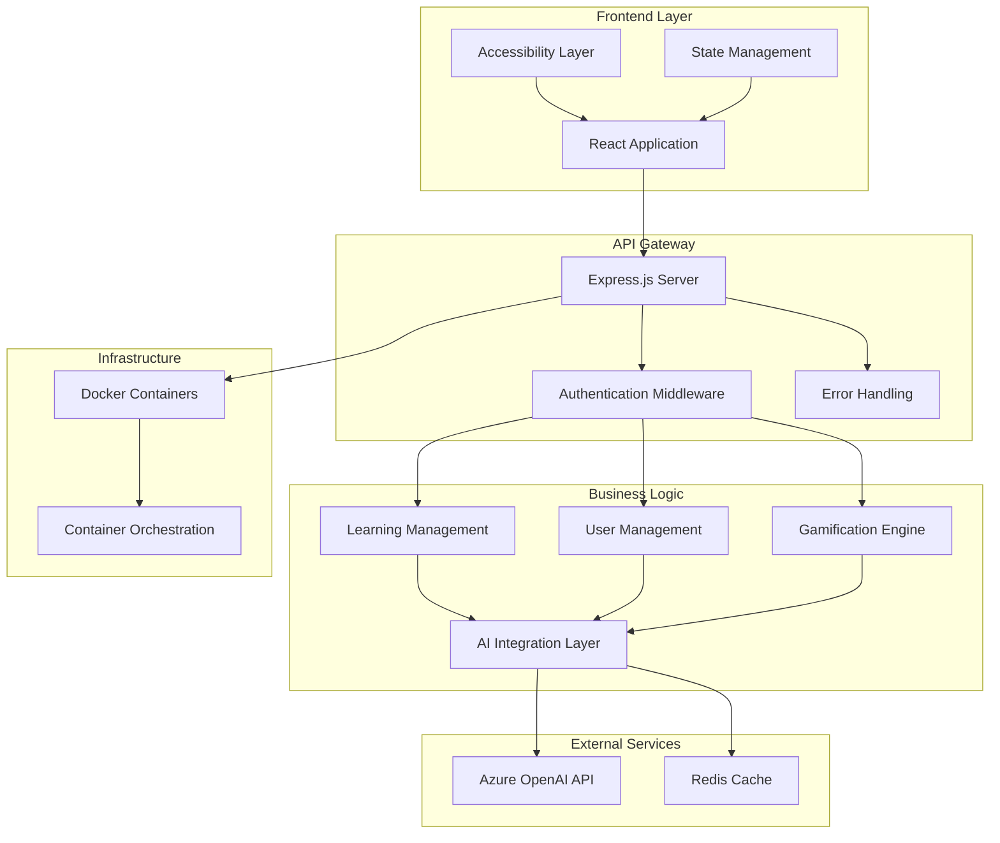
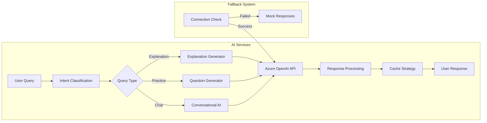
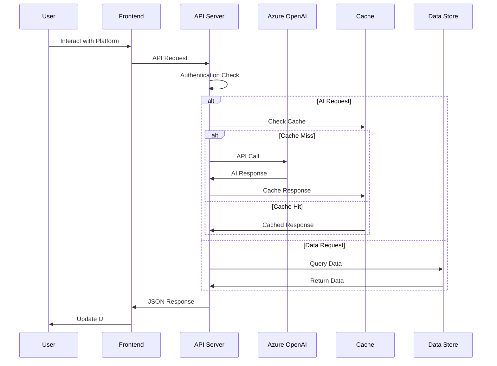
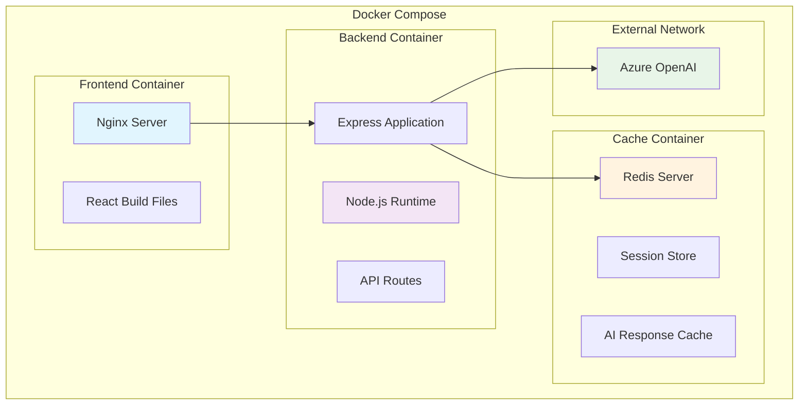

# EduMind AI - Intelligent Learning Platform

## 🏆 Hackathon Project Overview

**EduMind AI** is a comprehensive EdTech platform that leverages Azure OpenAI to deliver personalized, adaptive learning experiences. Built with accessibility-first principles and gamification mechanics, it creates an engaging environment for learners of all abilities.

### 🎯 Problem Statement
Traditional learning platforms lack personalization, accessibility features, and engaging user experiences. Students often struggle with one-size-fits-all content that doesn't adapt to their learning styles or pace.

### 💡 Solution
EduMind AI combines AI-powered tutoring, gamified learning experiences, and comprehensive accessibility features to create a truly inclusive and adaptive learning platform.

---

## 🏗️ Architecture Overview

### System Architecture


### AI Integration Architecture


### Data Flow Architecture


### Container Architecture


---

## 🚀 Key Features

### 🎓 AI-Powered Learning
- **Intelligent Tutoring**: Azure OpenAI-powered explanations and guidance
- **Adaptive Content**: Personalized learning paths based on user performance
- **Practice Generation**: AI-generated questions and quizzes
- **Real-time Assistance**: Conversational AI for instant help

### ♿ Accessibility First
- **Screen Reader Support**: Full ARIA compliance and semantic HTML
- **Keyboard Navigation**: Complete keyboard accessibility
- **High Contrast Mode**: Enhanced visual accessibility
- **Font Size Controls**: Customizable text sizing
- **Reduced Motion**: Animation controls for sensitive users
- **Multiple Learning Styles**: Visual, auditory, kinesthetic, and reading/writing support

### 🎮 Gamification
- **XP System**: Experience points for completed activities
- **Level Progression**: Unlock new content as you advance
- **Achievement Badges**: Milestone recognition system
- **Learning Streaks**: Daily learning incentives
- **Leaderboards**: Social competition features

### 📊 Analytics & Progress
- **Detailed Progress Tracking**: Course completion and time spent
- **Performance Analytics**: Learning pattern insights
- **Goal Setting**: Personalized learning objectives
- **Achievement History**: Complete record of accomplishments

---

## 🛠️ Technology Stack

### Frontend
- **React 18**: Modern component architecture
- **React Router**: Client-side routing
- **Tailwind CSS**: Utility-first styling
- **Heroicons**: Accessible icon library
- **React Hook Form**: Form management
- **Axios**: HTTP client with interceptors

### Backend
- **Node.js**: JavaScript runtime
- **Express.js**: Web application framework
- **JWT**: Secure authentication
- **bcryptjs**: Password hashing
- **Helmet**: Security middleware
- **CORS**: Cross-origin resource sharing

### AI Integration
- **Azure OpenAI**: GPT models for intelligent responses
- **Custom Prompting**: Optimized prompts for educational content
- **Fallback System**: Mock responses for development/demo

### Infrastructure
- **Docker**: Containerization
- **Docker Compose**: Multi-service orchestration
- **Redis**: Caching and session storage
- **Nginx**: Reverse proxy and static file serving

---

## 📁 Project Structure

```
EduMind-AI/
├── docker-compose.yml              # Multi-service orchestration
├── README.md                       # This file
│
├── backend/                        # Node.js API Server
│   ├── server.js                  # Express application entry point
│   ├── package.json               # Backend dependencies
│   ├── Dockerfile                 # Backend container config
│   ├── routes/                    # API route definitions
│   │   ├── auth.js               # Authentication endpoints
│   │   ├── ai.js                 # AI integration endpoints
│   │   ├── learning.js           # Learning management
│   │   ├── gamification.js       # XP, levels, achievements
│   │   └── user.js               # User management
│   ├── middleware/                # Express middleware
│   │   ├── auth.js               # JWT authentication
│   │   └── errorHandler.js       # Global error handling
│   ├── services/                  # Business logic services
│   │   ├── azureOpenAI.js        # AI service integration
│   │   └── redis.js              # Caching service
│   └── .env.example              # Environment variables template
│
└── frontend/                      # React Application
    ├── package.json              # Frontend dependencies
    ├── Dockerfile                # Frontend container config
    ├── tailwind.config.js        # Tailwind CSS configuration
    ├── src/
    │   ├── App.js               # Main application component
    │   ├── index.js             # React entry point
    │   ├── contexts/            # React Context providers
    │   │   ├── AuthContext.js   # Authentication state
    │   │   ├── ThemeContext.js  # Theme management
    │   │   └── AccessibilityContext.js # Accessibility controls
    │   ├── components/          # Reusable UI components
    │   │   ├── Layout/          # Application layout
    │   │   └── UI/              # UI component library
    │   ├── pages/               # Route components
    │   │   ├── HomePage.js      # Landing page
    │   │   ├── LoginPage.js     # User authentication
    │   │   ├── DashboardPage.js # User dashboard
    │   │   ├── CoursesPage.js   # Course catalog
    │   │   ├── LearningPage.js  # Course content
    │   │   ├── AITutorPage.js   # AI tutoring interface
    │   │   ├── ProgressPage.js  # Analytics dashboard
    │   │   └── ProfilePage.js   # User settings
    │   ├── services/            # API integration
    │   │   └── api.js          # Axios configuration
    │   └── styles/              # CSS and styling
    │       └── globals.css      # Global styles
    └── public/                   # Static assets
        ├── index.html           # HTML template
        └── favicon.ico          # Site icon
```

---

## 🔧 Setup & Installation

### Prerequisites
- Docker and Docker Compose
- Node.js 18+ (for local development)
- Azure OpenAI API access (optional for full AI features)

### Quick Start
```bash
# Clone the repository
git clone https://github.com/your-username/EduMind-AI.git
cd EduMind-AI

# Configure environment variables
cp backend/.env.example backend/.env
# Edit backend/.env with your Azure OpenAI credentials

# Build and run with Docker Compose
docker-compose up --build

# Access the application
# Frontend: http://localhost:3000
# Backend API: http://localhost:5000
```

### Environment Configuration
```bash
# backend/.env
NODE_ENV=development
PORT=5000
JWT_SECRET=your-jwt-secret-key
REDIS_URL=redis://redis:6379

# Azure OpenAI Configuration
AZURE_OPENAI_API_KEY=your-api-key
AZURE_OPENAI_ENDPOINT=your-endpoint
AZURE_OPENAI_DEPLOYMENT_NAME=your-deployment-name
AZURE_OPENAI_API_VERSION=2024-02-15-preview
```

### Development Mode
```bash
# Backend development
cd backend
npm install
npm run dev

# Frontend development (separate terminal)
cd frontend
npm install
npm start
```

---

## 🎯 API Endpoints

### Authentication
```
POST /api/auth/register    # User registration
POST /api/auth/login       # User login
POST /api/auth/logout      # User logout
POST /api/auth/refresh     # Token refresh
```

### Learning Management
```
GET  /api/learning/courses          # List all courses
GET  /api/learning/courses/:id      # Get course details
POST /api/learning/enroll/:id       # Enroll in course
GET  /api/learning/my-courses       # User's enrolled courses
POST /api/learning/complete-lesson  # Mark lesson complete
```

### AI Integration
```
POST /api/ai/chat         # General AI conversation
POST /api/ai/explain      # Get explanation of concept
POST /api/ai/questions    # Generate practice questions
POST /api/ai/feedback     # Get learning feedback
```

### Gamification
```
GET  /api/gamification/progress      # User XP and level
GET  /api/gamification/achievements  # User achievements
POST /api/gamification/award-xp      # Award experience points
GET  /api/gamification/leaderboard   # Top learners
```

### User Management
```
GET  /api/user/profile         # Get user profile
PUT  /api/user/profile         # Update profile
GET  /api/user/preferences     # Get user preferences
PUT  /api/user/preferences     # Update preferences
GET  /api/user/activity        # Get learning activity
```

---

## 🔐 Security Features

### Authentication & Authorization
- JWT-based authentication with refresh tokens
- Password hashing using bcryptjs
- Protected routes with middleware validation
- Session management with Redis

### API Security
- CORS configuration for cross-origin requests
- Helmet.js for security headers
- Request rate limiting
- Input validation and sanitization

### Data Protection
- Environment variable configuration
- Secure password storage
- API key protection
- Error message sanitization

---

## ♿ Accessibility Features

### WCAG Compliance
- **Level AA compliance** across all components
- Semantic HTML structure with proper heading hierarchy
- Alt text for images and icons
- Focus management and keyboard navigation

### Screen Reader Support
- ARIA labels and descriptions
- Live regions for dynamic content updates
- Skip links for navigation
- Proper form labeling and error handling

### Visual Accessibility
- High contrast mode toggle
- Customizable font sizes
- Color-blind friendly palette
- Reduced motion preferences

### Keyboard Navigation
- Tab order optimization
- Keyboard shortcuts
- Focus indicators
- Escape key handling

---

## 🎮 Gamification System

### Experience Points (XP)
```javascript
// XP Award Structure
const xpRewards = {
  lessonComplete: 50,
  quizPassed: 100,
  streakBonus: 25,
  courseComplete: 500,
  achievementUnlock: 200
};
```

### Level System
- **Level 1-5**: Beginner (0-1000 XP)
- **Level 6-10**: Intermediate (1000-3000 XP)
- **Level 11-15**: Advanced (3000-6000 XP)
- **Level 16+**: Expert (6000+ XP)

### Achievements
- 🎓 **First Steps**: Complete first lesson
- 🔥 **Streak Master**: 7-day learning streak
- 🏆 **Course Champion**: Complete first course
- 🧠 **Knowledge Seeker**: Ask 50 AI questions
- ⭐ **Perfect Score**: Score 100% on a quiz

---

## 🚀 Deployment

### Docker Deployment
```bash
# Production build
docker-compose -f docker-compose.prod.yml up -d

# Scale services
docker-compose up --scale backend=3
```

### Environment-Specific Configurations
```yaml
# docker-compose.prod.yml
version: '3.8'
services:
  frontend:
    build:
      context: ./frontend
      dockerfile: Dockerfile.prod
    ports:
      - "80:80"
  
  backend:
    build: ./backend
    environment:
      - NODE_ENV=production
    deploy:
      replicas: 3
```

---

## 🤝 Contributing

### Development Guidelines
1. Follow accessibility-first development
2. Write comprehensive tests
3. Use semantic commit messages
4. Maintain TypeScript compatibility
5. Document API changes

### Code Style
- ESLint configuration for consistent code style
- Prettier for code formatting
- Husky pre-commit hooks
- Conventional commit messages

---

## 📊 Performance Optimizations

### Frontend Optimizations
- **Code Splitting**: Route-based lazy loading
- **Memoization**: React.memo and useMemo hooks
- **Image Optimization**: WebP format with fallbacks
- **Bundle Analysis**: Webpack bundle analyzer

### Backend Optimizations
- **Redis Caching**: API response caching
- **Connection Pooling**: Database connection management
- **Compression**: Gzip compression middleware
- **Rate Limiting**: API request throttling

### AI Response Optimization
- **Response Caching**: Cache AI responses for common queries
- **Prompt Optimization**: Efficient prompt engineering
- **Fallback System**: Graceful degradation when AI unavailable
- **Streaming Responses**: Real-time response delivery

---

## 📈 Future Enhancements

### Planned Features
- 🌐 **Multi-language Support**: i18n implementation
- 📱 **Mobile App**: React Native application
- 🎥 **Video Integration**: Interactive video lessons
- 👥 **Collaborative Learning**: Group study features
- 📊 **Advanced Analytics**: Machine learning insights
- 🔊 **Voice Interaction**: Speech-to-text and text-to-speech

### Scalability Improvements
- Microservices architecture migration
- Database sharding strategies
- CDN integration for global content delivery
- Kubernetes orchestration

---

## 📄 License

This project is licensed under the MIT License - see the [LICENSE](LICENSE) file for details.

---

## 🏆 Hackathon Submission

### Team Information
- **Project**: EduMind AI
- **Category**: EdTech/AI Innovation
- **Tech Stack**: React, Node.js, Azure OpenAI, Docker
- **Key Features**: AI Tutoring, Accessibility, Gamification

### Demo Credentials
```
Email: demo@edumind.ai
Password: Demo123!
```


**Built with ❤️ for accessible, inclusive education**